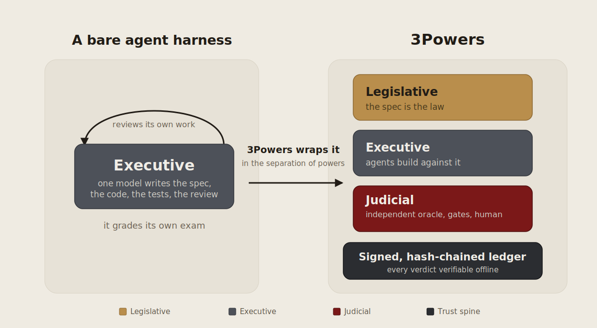
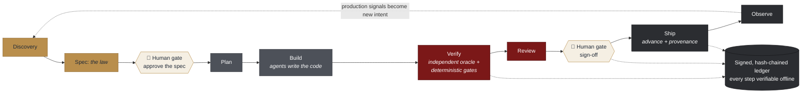

<p align="center">
  
</p>

# 3Powers

> **The spec is the law. Agents execute. An independent judiciary determines whether the implementation complies with the spec.**

[](LICENSE)
[](engine/pyproject.toml)
[](docs/STATUS.md)
[](docs/STATUS.md)

<p align="center">
  
</p>

**3Powers is a harness with a judiciary, built for teams that need to trust agent output at enterprise scale.** It drives your coding agents through the whole agentic lifecycle at high autonomy, then does the one thing a bare harness never does, it refuses to take their word for it. Agents do the building. An *independent* judiciary, made of an [oracle](docs/glossary.md#oracle) that never saw the code, a deterministic gate suite, and a signed, tamper-evident ledger, proves that what shipped matches the spec you approved. You appear at exactly two moments: **approving the spec, and the final sign-off.** Everything in between runs without prompting you, driven by 3Powers' own native executive and your coding-agent integration and judged locally by `3pwr`, with no CI/CD platform required and no lock-in to any model family, language, or LLM provider. Every [verdict](docs/glossary.md#verdict) and sign-off is hash-chained and Ed25519-signed in a ledger you can verify offline. "The agents said it passed" becomes "here is the signed, independent proof."

3Powers is the working implementation of the [*AI-First SDD Playbook*](https://verzcar.github.io/3powers/the_AI-First_SDD_Playbook_v1_0.html): the playbook defines the laws, 3Powers enforces them mechanically.

## The problem: when one model does everything, validation is a mirror

Hand a capable agent a feature and it will happily write the spec, the code, the tests, *and* the review. They all agree, because they all came from the same mind. A passing build only proves the model agreed with itself; nothing independent ever checked the work. 3Powers calls this the **separation-of-powers collapse**. The scarce thing is no longer the code. It is the **confidence that the code does what was intended.**

## The fix: restore the separation of powers

3Powers splits every change across three branches that hold each other accountable, mechanically rather than as a matter of good intentions:

- ⚖️ **Legislative: the spec is the law.** Versioned, testable requirements are the single source of truth every later stage answers to.
- 🛠️ **Executive: agents build against it.** They may write their own tests, but those can never *replace* the independent check.
- 👩‍⚖️ **Judicial: an independent judiciary decides.** An **oracle** authored from the spec by a *different model family*, a **deterministic gate suite**, and a **human sign-off**.

One picture, the eight-stage lifecycle, with the only two moments that need a human marked in parchment:



<sub>Gold = legislative · slate = executive · oxblood = judicial · parchment = the two human gates · charcoal = the [trust spine](docs/glossary.md#trust-spine). In `auto` mode everything between the two parchment gates runs without prompting you, driven by the native executive plus a coding-agent integration and judged by the deterministic gates. All terms of art: [glossary](docs/glossary.md).</sub>

## What you get

- **An independent oracle.** Acceptance tests authored *from the spec alone*, by a different model family than the coder. At the strictest tier the **oracle authoring** runs headlessly in a sanitized workspace where the implementation is physically absent — the coder never grades its own exam. The native executive dispatches the coder leg headlessly too; the fuller proof (the coder under a second, different-family CLI) is a documented [residual](docs/glossary.md#residual) — see [STATUS](docs/STATUS.md).
- **A deterministic verdict.** One cheapest-first gate suite, `format → lint → types → spec_integrity → tests + diff_coverage → mutation → sast → dependency_scan → secret_scan → gate_gaming → spec_conformance`, plus [work-kind](docs/glossary.md#work-kind)-shaped gates (the canonical list lives in [Engine Architecture](docs/engine-architecture.md)). Same result regardless of which model wrote the code, every failure named and locatable.
- **A local [trust spine](docs/glossary.md#trust-spine).** Every verdict and sign-off is hash-chained and Ed25519-signed in an append-only ledger you can verify **offline**; a local `advance` gate refuses to ship without green gates *and* a human sign-off. Tamper-evident, reconstructable from the repo alone.
- **Risk-tiered rigor.** `Cosmetic` / `Standard` / `High-risk` set every threshold from one knob, and **you never satisfy a gate by weakening it**: gaming attempts are flagged for human review.
- **Polyglot and provider-agnostic.** Languages plug in through a declarative adapter (TypeScript, Python, Go) with zero core changes; swap model vendors freely. The executive is **native and provider-agnostic**; **Git** is the substrate.
- **Proven on itself.** The `3pwr` engine gates its own code, with its trust-spine modules at the **High-risk** tier, mutation testing included.

## Quickstart: the autonomous path

Install `3pwr` with [uv](https://docs.astral.sh/uv/) — `uv tool install 3powers` (published on PyPI as **3powers**; the command it installs is `3pwr`), or `uvx 3powers` to run it once without installing. To work from a clone of this repository instead, use the from-source install in step 1 below. Then make your project 3Powers-ready with the guided setup and let one command drive the whole lifecycle. The autonomous path drives a headless **coding-agent integration** (such as Claude Code or the GitHub Copilot CLI) through 3Powers' own native executive — no external orchestration substrate. The deterministic gates, ledger, and enforcement are pure `3pwr` and need no agent at all: the [gates-only path](docs/getting-started.md#prerequisites) works fully offline.

```bash
# 1. From source: install the engine from a clone (provides the `3pwr` command).
#    Needs uv (https://docs.astral.sh/uv/) and git. Released users: `uv tool install 3powers`.
git clone https://github.com/VerzCar/3powers.git && cd 3powers && uv tool install ./engine

# 2. In YOUR project (new or existing), run the guided onboarding. It asks for the directory, the
#    language, where to keep the signing key (always OUTSIDE the repo), and whether autonomous
#    mode is your default. It also seeds the native agent-backend manifests (.3powers/agents/).
cd /path/to/your/project && 3pwr init

# 3. Describe what you want built, and let the lifecycle run:
3pwr run "add rate limiting to the login endpoint" --mode auto
```

`3pwr run` streams a live stage tracker and in `auto` mode **stops only at the two human gates**: approving the spec, and the final sign-off. Every step lands in the signed, offline-verifiable ledger, so a run is resumable and auditable. If you are new, the hands-on **[Getting Started](docs/getting-started.md)** guide walks every command with real, reproducible output.

## Manual mode: drive every stage yourself

Every stage is also a command you can run by hand. Author and plan the work with the `3pwr` CLI, then — switching the chat model for the judiciary — drive the independent answer key and gates with the `/3pwr.*` prompts: `/3pwr.oracle` (the independent answer key) → `/3pwr.verify` → `/3pwr.review` → `/3pwr.signoff` → `/3pwr.advance`. On an *existing* codebase, start with `/3pwr.characterize`.

You can also drive the gates directly. Real-world CLI testing lives in the **`e2e/` kit** — a small sample project per language adapter, each with a fixed notebook that provisions a throwaway sandbox and drives the whole lifecycle. The one-command entry point:

```bash
./e2e/run.sh typescript            # full lifecycle run (dispatches the configured headless agent)
./e2e/run.sh typescript --check    # deterministic, no-agent path: baseline gates + a sim-runner run
```

Inside the sandbox it drives the same commands you can run by hand — `3pwr gate run` (Standard tier), then `3pwr verify` (recompute the signed ledger, offline), `3pwr signoff`, and `3pwr advance` (which refuses without a green verdict **and** a human sign-off).

Every run emits one normalized verdict a human can read without opening a single agent transcript:

```
verdict FAIL  spec=VUTIL tier=Standard adapter=typescript
  ✓ format · biome          ✓ lint · biome        ✓ types · tsc
  ✓ tests · vitest          ✓ diff_coverage · 3pwr-covdiff  (100.0% ≥ 80.0%)
  ✗ dependency_scan · osv-scanner
      - GHSA-4x5r-pxfx-6jf8 in @babel/core
  ✓ secret_scan             ✓ gate_gaming         ✓ spec_conformance  (5 requirements traced)
  failures:
    • vulnerable_dependency: GHSA-4x5r-pxfx-6jf8 in @babel/core
  ↳ ledger entry #0 signed by ed25519:4fd71c543b0f499c
```

## Supported languages and technology stack

A language plugs in through a declarative **adapter** with zero changes to the core, and a framework like **Next.js is covered by its language adapter (TypeScript)**; there is no framework-specific setup. `3pwr init` sets up the adapter for your chosen language automatically.

| Language | Detected by | Status |
|---|---|---|
| **TypeScript** | `package.json` + `tsconfig.json` | Reference: exercised end-to-end |
| **Python** | `pyproject.toml` | Reference: gates the engine itself |
| **Go** | `go.mod` | Reference: wired |

The full per-language tooling matrix (format / lint / types / test / mutation / design oracles) lives in [Getting Started](docs/getting-started.md#supported-languages--tooling-matrix). To add a language, you write a manifest; see [`.3powers/adapters/CONTRACT.md`](.3powers/adapters/CONTRACT.md).

## Who it is for

- **Teams who have handed execution to agents and now need to trust the output**, without reading every transcript or hoping the tests mean something.
- **Regulated or high-assurance work** that needs an auditable, signed trail from spec to verdict to sign-off to build provenance.
- **Anyone using an agent scaffold** (GitHub Spec Kit or otherwise) who wants the missing judiciary layer: independent validation and local, enforceable trust.

## Documentation

Full guides live in **[`docs/`](docs/)**:

- **[Concepts](docs/concepts.md)**: the three powers, the lifecycle, risk tiers, oracle independence, the trust spine.
- **[Getting Started](docs/getting-started.md)**: prerequisites, install, and the whole thing end-to-end.
- **[Glossary](docs/glossary.md)**: every term of art, defined once (trust spine, oracle, Phase A/B, residual, A1-A6, …).
- **[Troubleshooting](docs/troubleshooting.md)**: the common failures with their exact fixes.
- **[Engine Architecture](docs/engine-architecture.md)**: the gates (canonical list), the verdict, and the ledger.
- **[CLI Reference](docs/cli-reference.md)**: every `3pwr` command and flag.
- **[Threat Model](docs/threat-model.md)**: what the ledger proves, against whom, under which assumptions.
- **[Brownfield Adoption](docs/brownfield.md)**: bring 3Powers to an existing codebase.
- **[STATUS](docs/STATUS.md)**: implementation status, validated against the spec (the single home of status).
- **[AI-First SDD Playbook](https://verzcar.github.io/3powers/the_AI-First_SDD_Playbook_v1_0.html)**: the field manual behind the harness. The playbook explains the what and the why; 3Powers is the how, enforced.

To contribute, see **[CONTRIBUTING.md](CONTRIBUTING.md)** (dev setup, platform support), **[GOVERNANCE.md](GOVERNANCE.md)**, and the **[Code of Conduct](CODE_OF_CONDUCT.md)**. To report a vulnerability, see **[SECURITY.md](SECURITY.md)**. The repo map lives in [STATUS](docs/STATUS.md).

## Status

**v1.0.0 — first stable release.** The full judiciary is built and self-applied at the strictest tier, and the engine ships on PyPI as **3powers** (`uv tool install 3powers`). Implementation status lives in exactly one place: **[docs/STATUS.md](docs/STATUS.md)**, the spec-validated breakdown of what is delivered versus [residual](docs/glossary.md#residual), and what is next.

## License

[Apache-2.0](LICENSE).

