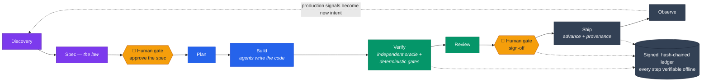

# 3Powers

> **The spec is the law. Agents execute. An independent judiciary decides whether the code obeys.**

[](LICENSE)
[](engine/pyproject.toml)
[](docs/references/speckit.md)
[](docs/STATUS.md)

**3Powers is a secure, trustworthy, enterprise-ready framework for building software with high autonomy in
agentic mode.** Agents do the building; an *independent* judiciary — an [oracle](docs/glossary.md#oracle)
that never saw the code, a deterministic gate suite, and a signed, tamper-evident ledger — proves that what
shipped matches the spec you approved. You stay in the loop at exactly two moments: **approving the spec,
and the final sign-off.** The stages in between run without prompting you — driven by GitHub Spec Kit and
your coding-agent integration, judged locally by `3pwr` — with no CI/CD platform required and no lock-in to
any model family, language, or LLM provider. Every [verdict](docs/glossary.md#verdict) and sign-off is
hash-chained and Ed25519-signed in a ledger you can verify offline: "the agents said it passed" becomes
"here is the signed, independent proof."

## The problem: when one model does everything, validation is a mirror

Hand a capable agent a feature and it will happily write the spec, the code, the tests, *and* the review.
They all agree — because they all came from the same mind. A passing build only proves the model agreed
with itself; nothing independent ever checked the work. 3Powers calls this the **separation-of-powers
collapse**. The scarce thing is no longer code — it's **confidence that the code does what was intended.**

## The fix: restore the separation of powers

3Powers splits every change across three branches that hold each other accountable — mechanically, not as
a matter of good intentions:

- ⚖️ **Legislative — the spec is the law.** Versioned, testable requirements are the single source of
  truth every later stage answers to.
- 🛠️ **Executive — agents build against it.** They may write their own tests, but those can never
  *replace* the independent check.
- 👩‍⚖️ **Judicial — an independent judiciary decides.** An **oracle** authored from the spec by a
  *different model family*, a **deterministic gate suite**, and a **human sign-off**.

One picture — the eight-stage lifecycle, with the only two moments that need a human marked in amber:



<sub>Purple = legislative · blue = executive · green = judicial · amber = the two human gates · slate =
the [trust spine](docs/glossary.md#trust-spine). In `auto` mode everything between the two amber gates
runs without prompting you — driven by GitHub Spec Kit + a coding-agent integration, judged by the
deterministic gates. All terms of art: [glossary](docs/glossary.md).</sub>

## What you get

- **An independent oracle.** Acceptance tests authored *from the spec alone*, by a different model family
  than the coder. At the strictest tier the **oracle authoring** runs headlessly in a sanitized workspace
  where the implementation is physically absent — the coder side runs interactively today (see
  [STATUS](docs/STATUS.md)). The coder never grades its own exam.
- **A deterministic verdict.** One cheapest-first gate suite — `format → lint → types → spec_integrity →
  tests + diff_coverage → mutation → sast → dependency_scan → secret_scan → gate_gaming →
  spec_conformance`, plus [work-kind](docs/glossary.md#work-kind)-shaped gates (the canonical list lives in
  [Engine Architecture](docs/engine-architecture.md)) — same result regardless of which model wrote the
  code, every failure named and locatable.
- **A local [trust spine](docs/glossary.md#trust-spine).** Every verdict and sign-off is hash-chained and
  Ed25519-signed in an append-only ledger you can verify **offline**; a local `advance` gate refuses to
  ship without green gates *and* a human sign-off. Tamper-evident, reconstructable from the repo alone.
- **Risk-tiered rigor.** `Cosmetic` / `Standard` / `High-risk` set every threshold from one knob, and
  **you never satisfy a gate by weakening it** — gaming attempts are flagged for human review.
- **Polyglot & provider-agnostic.** Languages plug in through a declarative adapter (TypeScript, Python,
  Go) with zero core changes; swap model vendors freely. Layers on **GitHub Spec Kit**; **Git** is the
  substrate.
- **Proven on itself.** The `3pwr` engine gates its own code — its trust-spine modules at the **High-risk**
  tier, mutation testing included.

## Quickstart — the autonomous path

Install the engine, make your project 3Powers-ready with the guided setup, then let one command drive the
whole lifecycle. The autonomous path composes **GitHub Spec Kit** — upstream
[`github/spec-kit`](https://github.com/github/spec-kit), installed from a pinned tag (see the
[Spec Kit reference](docs/references/speckit.md#install--init)) — plus a coding-agent integration (e.g.
GitHub Copilot). The deterministic gates, ledger, and enforcement are pure `3pwr` and need neither: the
[gates-only path](docs/getting-started.md#prerequisites) works fully offline.

```bash
# 1. Install the engine from a clone (provides the `3pwr` command).
#    Needs uv (https://docs.astral.sh/uv/) and git.
git clone https://github.com/VerzCar/3powers.git && cd 3powers && uv tool install ./engine

# 2. In YOUR project (new or existing), run the guided onboarding. It asks for the directory, the
#    language, where to keep the signing key (always OUTSIDE the repo), and whether autonomous
#    mode is your default. `--with-speckit` also scaffolds Spec Kit; plain `3pwr init` is offline.
cd /path/to/your/project && 3pwr init --with-speckit

# 3. Describe what you want built, and let the lifecycle run:
3pwr run "add rate limiting to the login endpoint" --mode auto
```

`3pwr run` streams a live stage tracker and in `auto` mode **stops only at the two human gates** —
approving the spec, and the final sign-off. Every step lands in the signed, offline-verifiable ledger, so
a run is resumable and auditable. New here? The hands-on **[Getting Started](docs/getting-started.md)**
guide walks every command with real, reproducible output.

## Prefer to drive it yourself? Manual mode

Every stage is also a command. Open the repo in VS Code with GitHub Copilot and drive it with slash
commands: `/speckit.specify → clarify → plan → tasks` → **switch the chat model** → `/3pwr.oracle` (the
independent answer key) → **switch back** → `/speckit.implement` → `/3pwr.verify` → `/3pwr.review` →
`/3pwr.signoff` → `/3pwr.advance`. On an *existing* codebase, start with `/3pwr.characterize`.

Or drive the gates directly — here on the bundled TypeScript sample (after `3pwr init` has created your
signer):

```bash
(cd examples/validation-utils && npm install)
3pwr gate run --path examples/validation-utils \
              --spec specs/001-validation-utils/spec.md --tier Standard
3pwr verify                                                    # recompute the signed ledger, offline
3pwr signoff --approver "$(git config user.name)" --stage review --spec-id VUTIL
3pwr advance --stage ship          # refuses without a green verdict AND a human sign-off
```

Every run emits one normalized verdict a human can read without opening a single agent transcript:

```
verdict FAIL  spec=VUTIL tier=Standard adapter=typescript
  ✓ format · biome          ✓ lint · biome        ✓ types · tsc
  ✓ tests · vitest          ✓ diff_coverage · 3pwr-covdiff  (100.0% ≥ 80.0%)
  ✗ dependency_scan · osv-scanner
      - GHSA-4x5r-pxfx-6jf8 in @babel/core
  ✓ secret_scan             ✓ gate_gaming         ✓ spec_conformance  (5 requirements traced)
  failures:
    • vulnerable_dependency: GHSA-4x5r-pxfx-6jf8 in @babel/core
  ↳ ledger entry #0 signed by ed25519:4fd71c543b0f499c
```

## Supported languages & technology stack

A language plugs in through a declarative **adapter** with zero changes to the core — and a framework like
**Next.js is covered by its language adapter (TypeScript)**; there is no framework-specific setup.
`3pwr init` sets up the adapter for your chosen language automatically.

| Language | Detected by | Status |
|---|---|---|
| **TypeScript** | `package.json` + `tsconfig.json` | Reference — exercised end-to-end |
| **Python** | `pyproject.toml` | Reference — gates the engine itself |
| **Go** | `go.mod` | Reference — wired |

The full per-language tooling matrix (format / lint / types / test / mutation / design oracles) lives in
[Getting Started](docs/getting-started.md#supported-languages--tooling-matrix). Don't see your language?
Adding one is "write a manifest" — see [`.3powers/adapters/CONTRACT.md`](.3powers/adapters/CONTRACT.md).

## Who it's for

- **Teams who've handed execution to agents and now need to trust the output** — without reading every
  transcript or hoping the tests mean something.
- **Regulated or high-assurance work** that needs an auditable, signed trail from spec → verdict →
  sign-off → build provenance.
- **Anyone adopting GitHub Spec Kit** who wants the missing judiciary layer: independent validation and
  local, enforceable trust.

## Documentation

Full guides live in **[`docs/`](docs/)**:

- **[Concepts](docs/concepts.md)** — the three powers, the lifecycle, risk tiers, oracle independence, the trust spine.
- **[Getting Started](docs/getting-started.md)** — prerequisites, install, and the whole thing end-to-end.
- **[Glossary](docs/glossary.md)** — every term of art, defined once (trust spine, oracle, Phase A/B, residual, A1–A6, …).
- **[Troubleshooting](docs/troubleshooting.md)** — the common failures with their exact fixes.
- **[Engine Architecture](docs/engine-architecture.md)** — the gates (canonical list), the verdict, and the ledger.
- **[CLI Reference](docs/cli-reference.md)** — every `3pwr` command and flag.
- **[Threat Model](docs/threat-model.md)** — what the ledger proves, against whom, under which assumptions.
- **[Brownfield Adoption](docs/brownfield.md)** — bring 3Powers to an existing codebase.
- **[STATUS](docs/STATUS.md)** — implementation status, validated against the spec (the single home of status).

Contributing? See **[CONTRIBUTING.md](CONTRIBUTING.md)** (dev setup, platform support),
**[GOVERNANCE.md](GOVERNANCE.md)**, and the **[Code of Conduct](CODE_OF_CONDUCT.md)**. To report a
vulnerability, see **[SECURITY.md](SECURITY.md)**. The repo map lives in [STATUS](docs/STATUS.md).

## Status

**v0.5 complete; v1.0 in progress** — the full judiciary is built and self-applied at the strictest tier.
Implementation status lives in exactly one place: **[docs/STATUS.md](docs/STATUS.md)** — the spec-validated
breakdown, what is delivered versus [residual](docs/glossary.md#residual), and what's next.

## License

[Apache-2.0](LICENSE).

---

- 📜 Specification — [`3Powers_Spec_v0.2.md`](specs/3Powers_Spec_v0.2.md)
- 🏛️ Constitution — [`.specify/memory/constitution.md`](.specify/memory/constitution.md)
